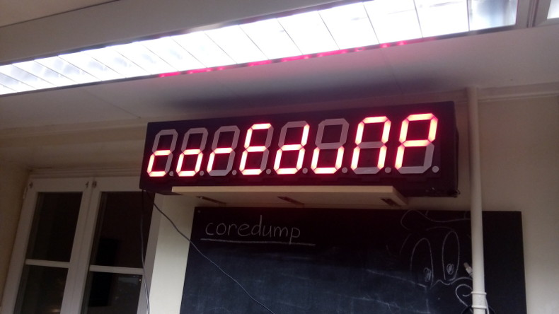

# 7 Segment Display

Lots of things can be displayed on a 7 segment display. Originally our model
was built for an "8 bit bar" where we piled up a lot of old TVs and hardware as
the "backdrop" for a bar at a student party.

The project uses an Arduino Nano, a MAX7219 and eight big 7 segment modules. To
control the MAX7219, we use Arduino's official LedControl library.

### Compile & Flash

    git submodule init
    git submodule update
    cd arduino
    make upload
